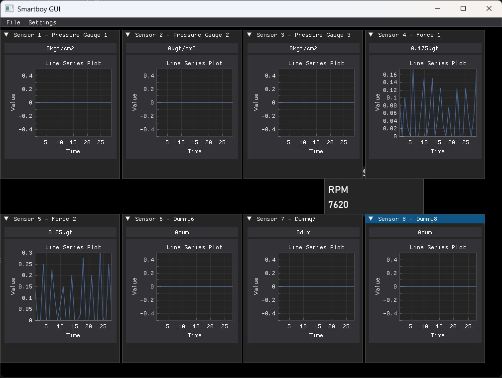
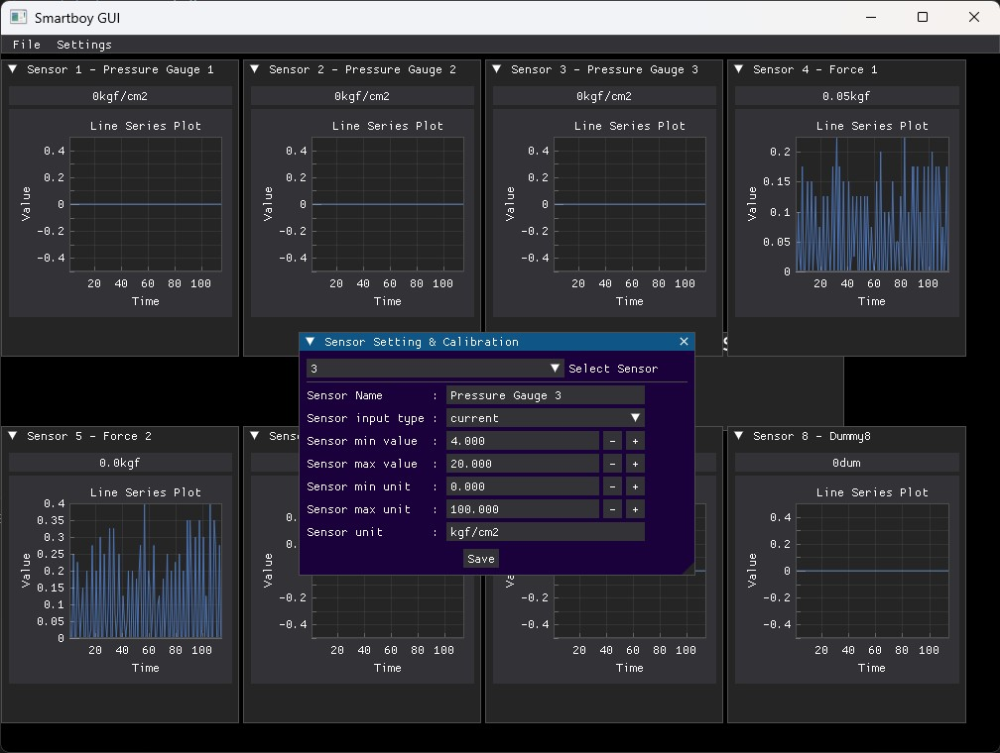

# ✨Smartboy GUI✨
## _Simple, Powerful and Designed for Everyone_

Smartboy GUI is a cross-platform, simple DAQ (Data Acquistion) graphical user interface.
It is dedicated for everyone, starting from hobbyists, students, lecturers, and event experts.
The GUI made possible thanks to [dearPyGUI](https://github.com/hoffstadt/DearPyGui).


## Communication Protocol
It is using digiboy v1 protocol, a protocol written on top serial (UART) communication with 115200 baud-rate.

### Protocol Example
```
S1=0.00mA;0.00mV;S2=0.00mA;0.00mV;S3=0.00mA;0.00mV;S4=0.00mA;0.00mV;XR=0rpm;
```

S1 means Sensor 1 and it has measurement value in milivolts and miliamps.

S2 and so on applies from above explanation.

XR means RPM Sensor.

## Features

- Cross platform! Tested on 3 main OSes: Linux, Windows and Mac
- Selecting COM Port easily
- Able to acquire 8 sensors (2 pcs module of Digiboy DAQ SP v1 module)
- Sensor calibration
- Automatically save to SQLite DB, and everyday has own DB file
- Open Source, You can edit it and ship it in Your work!

## Showcase



